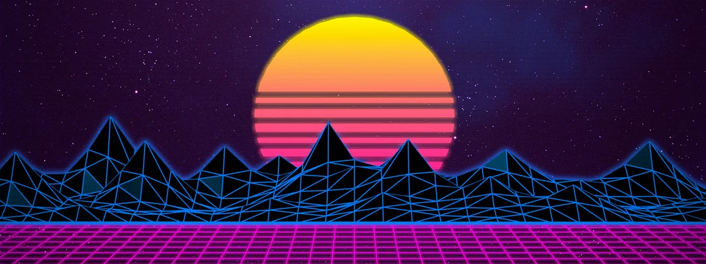

# 🖖 Greetings, I am Tamashkov Valeriy!

- 👨‍🔬 Full-stack developer
- 🖥️ 3+ years of commercial development experience
- 🧠 I have a qualification as an engineer and completed postgraduate studies
- 🛠️ My development stack:
  - [Markup] HTML5, JSX (semantic / valid markup, accessibility, SEO)
  - [Styles] CSS3 (Flexbox, CSS Grid Layout, responsive web design), Sass (SCSS), PostCSS, Bootstrap, Tailwind, BEM, Framer Motion, CSS Modules
  - [Basic language] JavaScript (ES6+, OOP), TypeScript, jQuery.
  - [SPA framework] React
  - [State managers] Redux (Redux Thunk, Redux Saga, Redux Toolkit (RTK Query), Redux Persist), Zustand, TanStack Query
  - [Routing] React Router
  - [SSR framework] Next.js
  - [Desktop] Electron
  - [Mobile] React Native
  - [Forms] React Hook Form, Zod, Yup
  - [Bundlers] Webpack, Vite
  - [Linters && formatters] ESLint, Stylelint, Prettier
  - [UI libraries] Material UI, Radix UI, Shadcn
  - [Testing] Vitest, Jest, Supertsest, React Testing Library, MSW, Cypress, Playwright, Storybook (+Chromatic)
  - [CMS] Strapi
  - [Maps] PostGIS, Leaflet.js
  - [Design] Figma (figma-to-code conversion / layout design), Adobe Photoshop, Adobe After Effects, CorelDraw, basic UX/UI principles
  - [Tools] Node.js, npm
  - [Backend frameworks] Express.js, NestJS
  - [DB] SQL, PostgreSQL, Prisma ORM, MongoDB, Mongoose ODM, Redis, Elasticsearch, Clickhouse, Neo4j, SQLite, S3-compatible storage
  - [CI/CD] GitHub Actions
  - [Monitoring & Observability] Grafana, Grafana Tempo, Grafana Loki, Prometheus
  - [API && Messaging] RESTful API, gRPC, WebSockets, OpenAPI, Swagger, Axios, RabbitMQ, Kafka, BullMQ
  - [Infrastructure] Docker (docker compose), Nginx, Kubernetes
  - [Auth] JWT (token-based auth), Session Cookies, Key-based auth, OAuth + OIDC, TOTP, Basic Auth, RBAC
  - [Architecture and methodologies] Feature-Sliced Design (FSD), Backend-for-Frontend (BFF), Microfrontend, Monolith, Modular Monolith, Microservice Architecture
  - [AI] LLM integration, Vercel AI SDK, RAG, LangGraph, Mem0
  - [GRAND stack] GraphQL, Apollo Client, Apollo Server
  - [VCS] Git (GitHub, GitLab)
  - [Project Management Tools] Trello, Jira, Confluence, GitHub Projects
  - [Project methodologies] Agile, SCRUM, Kanban
  - [QA & Debugging Tools] Postman, Wireshark, Fiddler, Chrome DevTools
- 🌐 My e-commerce (pet) project: [https://cybersite2077.online](https://cybersite2077.online/)
- 🗄️ My API Server (REST) with 70+ different endpoints (Google AIP): [https://github.com/ValeriyTm/VLR-Taiga-Server](https://github.com/ValeriyTm/VLR-Taiga-Server/)
